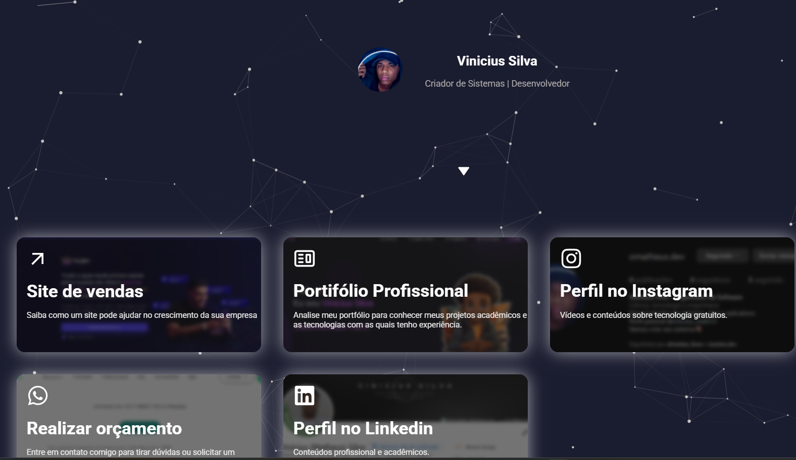

# 🌐 Meus Links - Página para Bio do Instagram 🔗

🚀 **Uma página moderna e responsiva** para centralizar meus principais links, permitindo que clientes conheçam meu trabalho e entrem em contato rapidamente.

🔗 **Demonstração:** [Acesse o site](https://meus-links-nine.vercel.app/)



---

## 📌 Funcionalidades
- 📱 **Design Responsivo** - Adaptado para todos os dispositivos  
- ⚡ **Código otimizado** - Carregamento rápido e eficiente  
- 🔗 **Links Personalizados** - Redes sociais e contatos principais  
- 🚀 **Hospedagem na Vercel** - Rápido e confiável  

---

## 🛠️ Tecnologias Utilizadas

- **React.js** ⚛️ - Framework para construção da interface
- **JavaScript (ES6+)** ✨ - Código moderno e eficiente
- **SASS (SCSS)** 🎨 - Estilização avançada
- **HTML5 & CSS3** 🏗️ - Estruturação e estilização
- **Vercel** 🚀 - Deploy e hospedagem

---

## 📥 Como instalar e rodar o projeto

```sh
# Clone o repositório
git clone https://github.com/seu-usuario/meus-links.git
cd meus-links

# Instale as dependências
npm install

# Execute o projeto
npm start

# Acesse no navegador
http://localhost:3000
```

---

## 📄 Licença

💼 **Projeto criado para facilitar o compartilhamento de contatos e redes sociais de forma prática e profissional.**

📧 **Contato:** [Seu Email ou WhatsApp]

💻 **Portfólio:** [Seu site ou GitHub]

Se gostou do projeto, não esqueça de deixar uma ⭐ no repositório! 🚀

